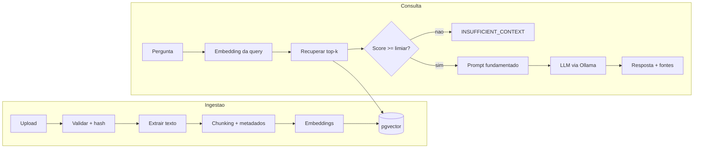

# FlowMind AI

**Assistente Pessoal de Conhecimento & Automação** com Geração Aumentada por
Recuperação (RAG) e modelos de linguagem locais.

O FlowMind AI permite enviar seus próprios documentos, indexá-los automaticamente e
fazer perguntas respondidas **somente** a partir do seu material — mostrando
exatamente **quais fontes e trechos** foram usados em cada resposta. Se a base de
conhecimento não contém a resposta, o FlowMind declara isso em vez de inventar.

Tudo roda localmente: um LLM local via **Ollama**, embeddings locais e
**PostgreSQL + pgvector** para a busca vetorial. Nenhum dado sai da sua máquina.


---

## Por que este projeto existe?

Este é um projeto pessoal de **Engenharia de IA**, criado para demonstrar, ponta a
ponta, os fundamentos de um sistema de RAG de produção:

- **RAG** (Retrieval-Augmented Generation) fundamentado em fontes;
- **Embeddings** e representação semântica de texto;
- **Busca vetorial** com pgvector (similaridade de cosseno);
- **Grounding** — o modelo responde apenas pelo contexto recuperado e recusa quando
  não há evidência suficiente, em vez de alucinar;
- **Avaliação** objetiva de recuperação e comportamento (Hit@K, recusas, latência);
- **LLM local** rodando offline via Ollama;
- **Arquitetura desacoplada** — LLM e embeddings atrás de interfaces, permitindo
  trocar de provedor (vLLM, OpenAI-compatible) sem reescrever o RAG.

O objetivo é mostrar não só "um chatbot", mas o entendimento de **como a recuperação
funciona** — por isso existe a tela **Explorador RAG**, que expõe os trechos e scores
sem passar pelo LLM.

---

## Demonstração

Fluxo completo: envie documentos, veja-os indexados, explore a recuperação e
converse com a sua base recebendo as fontes exatas.

| Painel | Documentos |
| :---: | :---: |
|  |  |
| **Assistente (resposta + fontes)** | **Explorador RAG (trechos + scores)** |
|  |  |

- **Painel** — quantidade de documentos, trechos, tipos de arquivo e documentos recentes.
- **Documentos** — upload por arrastar & soltar, lista, status e exclusão.
- **Assistente** — resposta fundamentada com cartões de fonte expansíveis
  (documento · seção · página · score).
- **Explorador RAG** — recuperação pura: os trechos mais próximos e seus scores de
  similaridade, **sem geração do LLM**.

---

## Como o RAG funciona aqui

```
documentos → chunks → embeddings → pgvector → retrieval → LLM → resposta com fontes
```

Cada trecho armazenado guarda os metadados necessários para a citação: `document_id`,
`filename`, `file_type`, `chunk_index`, `section`, `page`, `content`, `embedding` e
`created_at`.

**Grounding.** O prompt de sistema instrui o modelo a responder apenas com o contexto
recuperado e a devolver `INSUFFICIENT_CONTEXT` quando não conseguir. Antes mesmo de
chamar o LLM, os trechos recuperados são filtrados por um limiar de similaridade
configurável (`SIMILARITY_THRESHOLD`); se nenhum passar, a aplicação encurta o fluxo e
retorna a resposta de "informação insuficiente" sem pedir ao modelo para preencher a
lacuna.

---

## Métricas atuais

Medidas nesta versão, com os documentos de exemplo indexados:

| Métrica | Valor |
| --- | --- |
| Testes do backend | **19/19** ✅ |
| Hit@5 (fonte esperada recuperada) | **100%** |
| Recusa correta em contexto insuficiente | **100%** |
| Latência média por pergunta | **~3,6 s** |

---

## Funcionalidades

- **Ingestão de documentos** — arrastar & soltar PDF, DOCX, MD e TXT; extração,
  chunking, embedding e indexação automáticos.
- **Chat RAG fundamentado** — respostas restritas ao contexto recuperado, com citações
  de fonte expansíveis (documento · seção · página · score).
- **Explorador RAG** — inspeciona a recuperação pura (top-k trechos e scores) sem
  geração do LLM.
- **Não alucina** — quando nenhum trecho passa do limiar, o LLM nunca é solicitado a
  inventar; a aplicação retorna "informação insuficiente".
- **Deduplicação** — uploads idênticos são detectados por hash de conteúdo e ignorados.
- **Provedores plugáveis** — LLM e embeddings atrás de interfaces, permitindo adicionar
  vLLM ou backends OpenAI-compatible sem tocar no código de RAG.
- **Harness de avaliação** — Hit@K, cobertura de termos esperados, precisão de recusa e
  latência sobre um dataset pequeno.
- **Observabilidade** — uma linha de log JSON por request com tempos de retrieval e LLM,
  contagem de trechos e o modelo usado.

---

## Stack tecnológica

| Camada        | Tecnologia                          |
| ------------- | ----------------------------------- |
| Backend       | Python 3.11, FastAPI, SQLAlchemy 2  |
| Banco vetorial| PostgreSQL 16 + pgvector            |
| LLM           | Ollama (`llama3.2:3b` por padrão)   |
| Embeddings    | Ollama (`nomic-embed-text`, 768-d)  |
| Frontend      | Vue 3, TypeScript, Vite, Vue Router |
| Contêineres   | Docker Compose                      |

### Por que estes embeddings?

A V1 usa **`nomic-embed-text` servido pelo Ollama**. Isso mantém um único runtime local
(sem dependência de PyTorch/`sentence-transformers`), produz vetores estáveis de 768
dimensões, roda totalmente offline e gratuito, e combina naturalmente com o LLM do
Ollama. O backend de embeddings é intercambiável atrás de `EmbeddingProvider`.

---

## Arquitetura

```
flowmind-ai/
├── backend/            App FastAPI
│   └── app/
│       ├── api/          rotas HTTP (documents, search, chat, stats)
│       ├── core/         config, database, logging
│       ├── ingestion/    extração (PDF/DOCX/MD/TXT) + chunking
│       ├── embeddings/   EmbeddingProvider + implementação Ollama
│       ├── llm/          LLMProvider + implementação Ollama
│       ├── rag/          pipeline de retrieval + chat fundamentado
│       ├── models/       modelos ORM + schemas Pydantic
│       └── services/     ingestão/gestão de documentos
├── frontend/           SPA Vue 3 + TS (Painel, Documentos, Assistente, Explorador RAG, Configurações)
├── sample_documents/   documentos sintéticos para testar perguntas cruzadas
├── evaluation/         dataset.json + evaluate.py
├── n8n/                automação V2 (placeholder)
├── fine_tuning/        fine-tuning V5 (placeholder)
└── docker-compose.yml
```



---

## Executando localmente

### Pré-requisitos

- [Docker](https://www.docker.com/) + Docker Compose
- [Ollama](https://ollama.com/) rodando no host
- Python 3.11+ e Node 20+ (apenas se rodar backend/frontend fora do Docker)

### 1. Baixe os modelos

```bash
ollama pull llama3.2:3b
ollama pull nomic-embed-text
```

### 2. Configure

```bash
cp .env.example .env
```

Os padrões funcionam de imediato em um ambiente local.

### 3a. Tudo no Docker

```bash
docker compose up --build
```

- Frontend: http://localhost:5180
- API + docs: http://localhost:8000/docs

O backend acessa o Ollama do host via `host.docker.internal`.

### 3b. Ou rode os serviços diretamente (desenvolvimento)

Suba apenas o Postgres no Docker:

```bash
docker compose up -d db
```

Backend:

```bash
cd backend
python -m venv .venv
# Windows: .venv\Scripts\activate   |   Unix: source .venv/bin/activate
pip install -r requirements.txt
uvicorn app.main:app --reload --port 8000
```

Frontend:

```bash
cd frontend
npm install
npm run dev   # http://localhost:5180
```

> Dica: se a porta 8000 já estiver em uso na sua máquina, rode o backend em outra
> porta (ex.: `--port 8010`) e crie `frontend/.env.local` com
> `VITE_API_BASE_URL=http://localhost:8010` (esse arquivo é ignorado pelo git).

### 4. Experimente

1. Abra **Documentos** e envie os arquivos de `sample_documents/`.
2. Abra **Explorador RAG** e busque — veja os trechos ranqueados e os scores.
3. Abra **Assistente** e pergunte _"Qual é a diferença entre RAG e fine-tuning?"_
4. Pergunte algo que não esteja nos documentos e veja o sistema recusar em vez de
   adivinhar.

---

## Configuração

Todas as configurações vêm de variáveis de ambiente (veja `.env.example`):

| Variável               | Padrão             | Descrição                                     |
| ---------------------- | ------------------ | --------------------------------------------- |
| `DATABASE_URL`         | Postgres local     | String de conexão do SQLAlchemy               |
| `LLM_PROVIDER`         | `ollama`           | Seletor do backend de LLM                     |
| `OLLAMA_BASE_URL`      | `localhost:11434`  | Endpoint do Ollama                            |
| `OLLAMA_MODEL`         | `llama3.2:3b`      | Modelo de chat                                |
| `LLM_NUM_CTX`          | `4096`             | Janela de contexto (limita memória local)     |
| `EMBEDDING_PROVIDER`   | `ollama`           | Seletor do backend de embeddings              |
| `EMBEDDING_MODEL`      | `nomic-embed-text` | Modelo de embeddings                          |
| `EMBEDDING_DIM`        | `768`              | Dimensão do vetor de embedding                |
| `RETRIEVAL_TOP_K`      | `5`                | Trechos recuperados por padrão                |
| `SIMILARITY_THRESHOLD` | `0.55`             | Similaridade mínima para confiar num trecho   |
| `MAX_UPLOAD_MB`        | `25`               | Tamanho máximo de upload                      |
| `ALLOWED_EXTENSIONS`   | `pdf,docx,md,txt`  | Whitelist de upload                           |
| `CHUNK_SIZE` / `CHUNK_OVERLAP` | `900` / `150` | Janela / sobreposição do chunking (palavras) |

---

## API

| Método   | Endpoint                  | Descrição                                    |
| -------- | ------------------------- | -------------------------------------------- |
| `POST`   | `/api/documents/upload`   | Envia & indexa um documento (multipart `file`) |
| `GET`    | `/api/documents`          | Lista os documentos indexados                |
| `GET`    | `/api/documents/{id}`     | Retorna um documento                         |
| `DELETE` | `/api/documents/{id}`     | Exclui um documento e seus trechos           |
| `POST`   | `/api/search`             | Recuperação semântica (sem LLM)              |
| `POST`   | `/api/chat`               | Resposta RAG fundamentada com fontes         |
| `GET`    | `/api/stats`              | Estatísticas do painel                       |
| `GET`    | `/api/health`             | Health check                                 |

Documentação interativa em `/docs`.

**Search** — `{ "query": "...", "top_k": 5 }` → trechos ranqueados com score,
documento, seção/página e conteúdo.

**Chat** — `{ "question": "...", "top_k": 5 }` →
`{ "answer": "...", "sources": [...], "status": "answered" | "insufficient_context" }`.

---

## Avaliação

Com o backend no ar e os documentos de exemplo indexados:

```bash
python evaluation/evaluate.py --api http://localhost:8000 --top-k 5
```

Relata **Hit@K** (a fonte esperada foi recuperada), **cobertura de termos esperados**,
**precisão de contexto insuficiente** (recusas corretas em perguntas sem resposta) e
**latência média**. Edite `evaluation/dataset.json` para adicionar casos.

---

## Testes

```bash
cd backend
pytest
```

Os testes unitários puros (extração, chunking, tratamento de erro dos provedores) rodam
em qualquer lugar. Os testes de integração que precisam de Postgres + Ollama são pulados
automaticamente quando a stack não está disponível.

Build / checagem de tipos do frontend:

```bash
cd frontend
npm run build
```

---

## Roadmap

| Versão  | Foco                                              |
| ------- | ------------------------------------------------- |
| **V1**  | RAG + Ollama + pgvector _(esta versão)_           |
| V2      | Automação de documentos com n8n                   |
| V3      | Melhorias de avaliação de RAG / reranking         |
| V4      | Servidor de inferência vLLM                       |
| V5      | Curadoria de dataset + fine-tuning                |
| V6      | Agents / tools                                    |

---

## Licença

[MIT](LICENSE)
