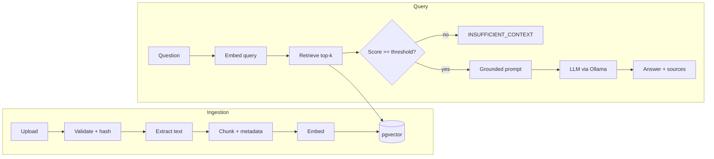

# FlowMind AI

**Personal Knowledge & Automation Assistant** powered by Retrieval-Augmented
Generation and local language models.

FlowMind AI lets you upload your own documents, index them automatically, and ask
questions that are answered **only** from your material — with every answer showing
exactly which sources and passages were used. If the knowledge base doesn't contain
the answer, FlowMind says so instead of inventing one.

Everything runs locally: a local LLM via **Ollama**, local embeddings, and
**PostgreSQL + pgvector** for retrieval. No data leaves your machine.

> _Screenshot placeholder — add `docs/dashboard.png`, `docs/rag-explorer.png`,
> `docs/assistant.png`._

---

## Features

- **Document ingestion** — drag & drop PDF, DOCX, MD and TXT; automatic
  extraction, chunking, embedding and indexing.
- **Grounded RAG chat** — answers constrained to retrieved context, with inline,
  expandable source citations (document · section · page · score).
- **RAG Explorer** — inspect pure retrieval (top-k chunks and similarity scores)
  with no LLM generation, to see _how_ retrieval works.
- **Refuses to hallucinate** — when no chunk clears the similarity threshold, the
  LLM is never asked to fabricate; the app returns "not enough information".
- **Deduplication** — identical uploads are detected by content hash and skipped.
- **Pluggable providers** — LLM and embeddings sit behind interfaces, so vLLM or
  OpenAI-compatible backends can be added without touching the RAG code.
- **Evaluation harness** — Hit@K, expected-term coverage, refusal accuracy and
  latency over a small dataset.
- **Observability** — one structured JSON log line per request with retrieval and
  LLM timings, chunk counts and the model used.

---

## Technology stack

| Layer        | Technology                          |
| ------------ | ----------------------------------- |
| Backend      | Python 3.11, FastAPI, SQLAlchemy 2  |
| Vector store | PostgreSQL 16 + pgvector            |
| LLM          | Ollama (`llama3.2:3b` by default)   |
| Embeddings   | Ollama (`nomic-embed-text`, 768-d)  |
| Frontend     | Vue 3, TypeScript, Vite, Vue Router |
| Containers   | Docker Compose                      |

### Why these embeddings?

V1 uses **`nomic-embed-text` served by Ollama**. This keeps a single local
runtime (no PyTorch/`sentence-transformers` dependency), produces stable 768-dim
vectors, runs fully offline and free, and pairs naturally with the Ollama LLM.
The embedding backend is swappable behind `EmbeddingProvider`.

---

## Architecture

```
flowmind-ai/
├── backend/            FastAPI app
│   └── app/
│       ├── api/          HTTP routers (documents, search, chat, stats)
│       ├── core/         config, database, logging
│       ├── ingestion/    extraction (PDF/DOCX/MD/TXT) + chunking
│       ├── embeddings/   EmbeddingProvider + Ollama implementation
│       ├── llm/          LLMProvider + Ollama implementation
│       ├── rag/          retrieval + grounded chat pipeline
│       ├── models/       ORM models + Pydantic schemas
│       └── services/     document ingestion/management
├── frontend/           Vue 3 + TS SPA (Dashboard, Documents, Assistant, RAG Explorer, Settings)
├── sample_documents/   synthetic docs to test cross-document questions
├── evaluation/         dataset.json + evaluate.py
├── n8n/                V2 automation (placeholder)
├── fine_tuning/        V5 fine-tuning (placeholder)
└── docker-compose.yml
```



---

## RAG pipeline

```
document → extraction → normalization → chunking → embeddings
        → pgvector → retrieval → context → LLM → answer → sources
```

Each stored chunk keeps the metadata needed for citation: `document_id`,
`filename`, `file_type`, `chunk_index`, `section`, `page`, `content`, `embedding`
and `created_at`.

**Grounding.** The system prompt instructs the model to answer only from the
retrieved context and to reply `INSUFFICIENT_CONTEXT` when it cannot. Before the
LLM is even called, retrieved chunks are filtered by a configurable
`SIMILARITY_THRESHOLD`; if none qualify, the app short-circuits and returns the
"not enough information" response without asking the model to fill the gap.

---

## Running locally

### Prerequisites

- [Docker](https://www.docker.com/) + Docker Compose
- [Ollama](https://ollama.com/) running on the host
- Python 3.11+ and Node 20+ (only if you run backend/frontend outside Docker)

### 1. Pull the models

```bash
ollama pull llama3.2:3b
ollama pull nomic-embed-text
```

### 2. Configure

```bash
cp .env.example .env
```

The defaults work out of the box for a local setup.

### 3a. Everything in Docker

```bash
docker compose up --build
```

- Frontend: http://localhost:5173
- Backend API + docs: http://localhost:8000/docs

The backend reaches the host's Ollama via `host.docker.internal`.

### 3b. Or run services directly (for development)

Start only Postgres in Docker:

```bash
docker compose up -d db
```

Backend:

```bash
cd backend
python -m venv .venv
# Windows: .venv\Scripts\activate   |   Unix: source .venv/bin/activate
pip install -r requirements.txt
uvicorn app.main:app --reload --port 8000
```

Frontend:

```bash
cd frontend
npm install
npm run dev   # http://localhost:5173
```

### 4. Try it

1. Open **Documents** and upload the files in `sample_documents/`.
2. Open **RAG Explorer** and search — see the ranked chunks and scores.
3. Open **Assistant** and ask _"What is the difference between RAG and fine-tuning?"_
4. Ask something not in the docs and watch it refuse instead of guessing.

---

## Configuration

All settings come from environment variables (see `.env.example`):

| Variable               | Default            | Description                                   |
| ---------------------- | ------------------ | --------------------------------------------- |
| `DATABASE_URL`         | local Postgres     | SQLAlchemy connection string                  |
| `LLM_PROVIDER`         | `ollama`           | LLM backend selector                          |
| `OLLAMA_BASE_URL`      | `localhost:11434`  | Ollama endpoint                               |
| `OLLAMA_MODEL`         | `llama3.2:3b`      | Chat model                                    |
| `LLM_NUM_CTX`          | `4096`             | Context window (bounds memory on local GPUs)  |
| `EMBEDDING_PROVIDER`   | `ollama`           | Embedding backend selector                    |
| `EMBEDDING_MODEL`      | `nomic-embed-text` | Embedding model                               |
| `EMBEDDING_DIM`        | `768`              | Embedding vector dimension                    |
| `RETRIEVAL_TOP_K`      | `5`                | Default chunks retrieved                      |
| `SIMILARITY_THRESHOLD` | `0.55`             | Min cosine similarity to trust a chunk        |
| `MAX_UPLOAD_MB`        | `25`               | Max upload size                               |
| `ALLOWED_EXTENSIONS`   | `pdf,docx,md,txt`  | Upload whitelist                              |
| `CHUNK_SIZE` / `CHUNK_OVERLAP` | `900` / `150` | Word-based chunking window / overlap     |

---

## API

| Method   | Endpoint                  | Description                                  |
| -------- | ------------------------- | -------------------------------------------- |
| `POST`   | `/api/documents/upload`   | Upload & index a document (multipart `file`) |
| `GET`    | `/api/documents`          | List indexed documents                       |
| `GET`    | `/api/documents/{id}`     | Get one document                             |
| `DELETE` | `/api/documents/{id}`     | Delete a document and its chunks             |
| `POST`   | `/api/search`             | Semantic retrieval only (no LLM)             |
| `POST`   | `/api/chat`               | Grounded RAG answer with sources             |
| `GET`    | `/api/stats`              | Dashboard statistics                         |
| `GET`    | `/api/health`             | Health check                                 |

Interactive docs at `/docs`.

**Search** — `{ "query": "...", "top_k": 5 }` → ranked chunks with score, document,
section/page and content.

**Chat** — `{ "question": "...", "top_k": 5 }` →
`{ "answer": "...", "sources": [...], "status": "answered" | "insufficient_context" }`.

---

## Evaluation

With the backend running and the sample documents indexed:

```bash
python evaluation/evaluate.py --api http://localhost:8000 --top-k 5
```

It reports **Hit@K** (was the expected source retrieved), **expected-term
coverage**, **insufficient-context accuracy** (correct refusals on unanswerable
questions) and **average latency**. Edit `evaluation/dataset.json` to add cases.

---

## Testing

```bash
cd backend
pytest
```

Pure unit tests (extraction, chunking, provider error handling) run anywhere.
Integration tests that need Postgres + Ollama skip automatically when the stack
isn't available.

Frontend build / type-check:

```bash
cd frontend
npm run build
```

---

## Roadmap

| Version | Focus                                             |
| ------- | ------------------------------------------------- |
| **V1**  | RAG + Ollama + pgvector _(this release)_          |
| V2      | Document automation with n8n                      |
| V3      | RAG evaluation improvements / reranking           |
| V4      | vLLM inference server                             |
| V5      | Dataset curation + fine-tuning                    |
| V6      | Agents / tools                                    |

---

## License

[MIT](LICENSE)
